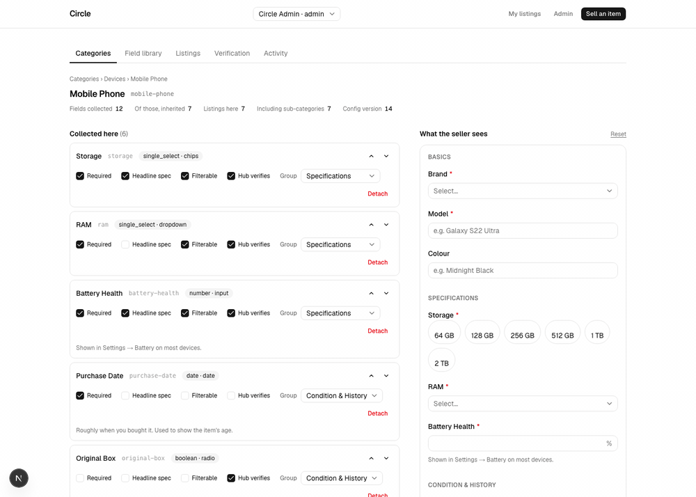

# Circle Seller Flow

A secondhand marketplace where **product categories define their own seller forms**.


**Live demo — https://circle-sell-flow.vercel.app**

No login. Use the **Role** control in the header to switch between
`admin@circle.example` (sees the admin console) and the two seeded sellers.



The admin console, with the seller's real form rendered beside the configuration — the
same component and the same contract the sell flow uses, not a mock-up. Assigning a
field from the shared library adds it to the seller's form on the next request: no
migration, no deploy, no code.

---

## The problem

Traditional marketplaces hardcode a form per category.

```
PhoneForm    LaptopForm    SofaForm    …
```

Engineering cost then grows linearly with the catalogue. This project stores the field
definitions in the database instead:

```
Category  →  Field definitions  →  One dynamic form  →  Validated listing
```

---

## Architecture

```
             Next.js App Router (RSC)
                        │
                        ▼
              Dynamic form renderer
                        │
                        ▼
         Form-schema resolver  ◄── the registry (rows)
                        │
                        ▼
          Zod validation  →  Server action / API
                        │
                        ▼
            Postgres  +  validation trigger
```

Two decisions usually conflated, made separately:

| Decision                          | Choice                                            |
| --------------------------------- | ------------------------------------------------- |
| Where field **definitions** live  | Fully normalised relational tables — the registry |
| Where a listing's **values** live | One `jsonb` column, keyed by immutable field slug |

```
categories ─────┐ id · parent_id · slug · name · sort · is_active · config_version
                │   (a tree: fields apply downward, nearest ancestor wins)
                ▼
        category_fields  ← the assignment: everything contextual lives here
                ▲          category_id · field_id · required · sort · group_id
                │          default_value · visible_when · help_text
                │          filterable · prominent · verifiable
                │
fields ─────────┘ id · slug UNIQUE · label · type · render_as · config
   │                placeholder · help_text · archived_at
   │                (a shared library: RAM is one row, used by two categories)
   ▼
field_options     id · field_id · value_slug · label · sort · archived_at
field_groups      id · slug · label · sort   (form sections, e.g. "Specifications")

listings          typed columns for what the platform reasons about
                  + category_id · attributes jsonb · verified_attributes jsonb
                  + schema_version · idempotency_key
audit_log         actor_id · action · entity_type · entity_id · before · after · at
```

---

## Tech stack

| Layer      | Technology                                   |
| ---------- | -------------------------------------------- |
| Framework  | Next.js 16 (App Router) · React 19           |
| Language   | TypeScript                                   |
| Validation | Zod — one schema, browser + server           |
| Database   | Postgres (Supabase in production)            |
| Data layer | Drizzle — typed SQL, not ORM magic           |
| UI         | Tailwind · shadcn/ui                         |
| Hosting    | Vercel — `bom1`, same region as the database |

---

## Design decisions

### Storage: `jsonb`, and the integrity bought back

| Option                       | Why not                                                                                                                                           |
| ---------------------------- | ------------------------------------------------------------------------------------------------------------------------------------------------- |
| Wide table, nullable columns | A migration plus a deploy per field — fails the brief's only hard requirement                                                                     |
| One table per category       | Most expensive; cross-category reads become `UNION`s over N tables of unknown shape                                                               |
| **EAV**                      | Stronger integrity and better planner statistics, but pays a pivot in _every_ read path and N-row writes, for filtering the brief never asked for |
| `jsonb` + an EAV projection  | The scaling exit path, not the starting point                                                                                                     |

Chosen: `jsonb` — no filtering requirement in the brief, dramatically less code in every
read path, and one validated object flows form → API → database → product page without a
transformation in the middle.

To be honest about the usual objection rather than repeat the folklore: "EAV has no type
safety and produces queries from hell" is backwards. Typed value columns plus a composite
foreign key make wrong data _physically unstorable_, and its filters are ordinary btree
predicates with real statistics. The accurate statement is that **EAV buys integrity and
query statistics at the cost of read ergonomics — I chose `jsonb` and bought the integrity
back with a trigger.** If faceted counts over tens of millions of listings were a day-one
requirement, EAV would have been right.

Three hardenings, without which `jsonb` is laziness rather than judgement:

1. **Immutable `slug` as the key, mutable `label` for display.** Renaming a field never
   touches a listing row; the slug input is disabled after creation and a trigger refuses
   a change.
2. **One validation definition, three enforcers** — below.
3. **Registry-aware writes.** Unknown keys rejected; keys must be active fields assigned
   to that category; select values must be live options; values coerced to the declared type.

### One validation definition, three enforcers

Validation is **generated from the registry**, never hand-written twice:

1. in the browser, so the seller gets inline errors;
2. in the API, because the client is never trusted;
3. in **Postgres**, as a trigger reading the same registry rows in SQL — so a writer that
   bypasses the application entirely (a script, a future mobile client, a 2 a.m. `psql`
   session) still cannot store attributes that contradict the configuration.

The trigger is the most load-bearing thing here, and it is what makes `jsonb` defensible.
It checks types, that every key is an active field the category actually collects, and that
select values are **live options of that exact field** — the referential integrity a foreign
key would have given us. It deliberately does _not_ check required-ness: completeness belongs
to publishing, not to a row, because drafts are legitimately incomplete.

### Fields are a library; assignments own the context

The brief separates "create, edit and organize listing **fields**" from "configure which
fields **belong to each category**", and its three example categories share five fields.
So the **field** owns identity and type — RAM is a single-select of GB values, forever —
while the **assignment row** owns everything contextual: required, order, group, default,
help text, visibility, filterable, verifiable.

Battery Health is required on a handset and optional on a laptop. One field, two policies,
no duplication.

### Inheritance is one recursive CTE

A category resolves fields from itself and every ancestor, and the **nearest ancestor wins**
on conflict — `DISTINCT ON (field_id) ORDER BY field_id, distance`. That is what makes
"required here, optional everywhere else" an override instead of a contradiction, and a
sibling category nearly free. Two queries resolve a whole form, options aggregated in a
lateral join, no N+1.

### Seller-claimed and hub-verified are two documents, never an overwrite

A listing carries
`attributes` (what the seller claims) and `verified_attributes` (what a hub measured), and
the page shows _"89% ✓ Verified · seller stated 92%"_ when they disagree. A `CHECK`
constraint makes a verified value that cannot name **who** recorded it and **when**
physically unstorable — an unattributable measurement is exactly the unfalsifiable claim
the feature exists to replace.

---

## Adding a category without touching code

1. **Admin → Categories → New category.** Name it "Tablet", parent "Devices". Its slug is
   derived, not typed, because a slug is a URL and an immutable key.
2. **Open it.** It already collects **7 fields it never declared** — Brand, Model, Colour,
   Under Warranty and Warranty Expiry from Devices, Purchase Date and Known Issues from
   Electronics above that. Mobile Phone itself declares 6 of the 12 fields a seller meets.
3. **Assign what is genuinely new** from the field library — reuse Storage and RAM rather
   than redefining them. Tick Required, Filterable, Hub verifies; group them; reorder. The
   panel on the right is the real seller form, updating as you go.
4. **Sell an item → Tablet.** The form is there, validated in three places, nothing deployed.

---

## Edge cases handled

Where a runtime-editable schema either holds up or quietly corrupts data:

- **Nothing is ever hard-deleted.** Fields, options and categories archive. Archived things
  leave new forms immediately and stay on every existing listing — configuration describes
  what to collect _now_, a listing records what was collected _then_.
- **Every destructive action states its blast radius first**, in listings, before it applies.
- **A field's type can never change in place.** Nothing can reinterpret "eight GB" as a
  number, so it is a new field plus an optional backfill.
- **Making a field required changes nothing about existing listings.** Validation is on
  write; a config change never reaches backwards. Completeness is derived on read, never
  stored, and shown only to a listing's own seller.
- **Hidden means absent.** A field hidden by its condition is not required and its value is
  _stripped server-side_ — otherwise a row claims both that there is no warranty and that
  it expires next March.
- **Visibility cycles and dead required fields are rejected at save time**, by validating the
  whole resolved schema rather than the row being edited. A required field behind an
  impossible condition is a form nobody can submit.
- **Re-parenting a category previews the swap** — the one edit whose effect is invisible from
  the row being edited.
- **Re-categorising a listing names every answer that will not survive** before applying,
  keeps what both categories collect, and logs the dropped values. The database enforces it:
  a category change revalidates every attribute.
- **Switching category mid-draft keeps the answers the new category still collects**, which
  falls out of the shared field library for free.
- **Values outlive their definitions.** A listing holding an archived field, a detached field
  or a retired option keeps rendering it under "Additional details".

---

## Running it locally

Requires **Node 20.9+** and **Docker** for the local Postgres. If you already have a
Postgres, skip `db:up` and point `DATABASE_URL` at it — nothing needs a Supabase-specific
feature or an extension.

```bash
npm ci
cp .env.example .env      # defaults already match the Docker Postgres
npm run db:up             # Postgres 17 on :54322, waits until healthy
npm run db:migrate        # plain SQL migrations, in order
npm run db:seed           # sample categories, fields and 17 listings
npm run dev               # http://localhost:3000
```

`cp .env.example .env` is genuinely step two: **`npm run build` fails without
`DATABASE_URL` set**, because the API route modules import the database client and it
validates its environment at import time. The variable must be present and well-formed; it
need not point at a running database — the build never connects, deliberately, so a deploy
cannot fail because Postgres is slow.

**Sample data.** `npm run db:seed` is destructive and re-runnable: it truncates every table
and reloads, so the database always ends in the same known state — six categories in two
trees, 22 fields, 28 assignments, and 17 listings across the three leaf categories,
including one draft, one sold, five with hub verifications and five with photos. Everything
it does is an `INSERT`; there is no DDL anywhere in it, which is the whole claim the project
makes.


| Account                | Role   | What it can do                          |
| ---------------------- | ------ | --------------------------------------- |
| `admin@circle.example` | admin  | Everything, including the admin console |
| `priya@example.com`    | seller | Browse and sell (the default)           |
| `rahul@example.com`    | seller | Browse and sell                         |

The switcher sets which account you are; it never sets a role. The role is read from the
user row on every request, so the cookie cannot grant a privilege the account does not have
— `/admin` refuses a seller who types the URL, and every mutation re-checks independently of
the page that rendered it.

---

## Repository structure

```
drizzle/            generated SQL migrations, committed and reviewed
public/             sample listing images
src/app/            routes — browse, sell, listing, admin, API
src/components/     ui/ is shadcn; form/ is the one renderer
src/db/             schema, client, migrate and seed
src/lib/            form-schema resolution, validation, listings, admin actions
```
