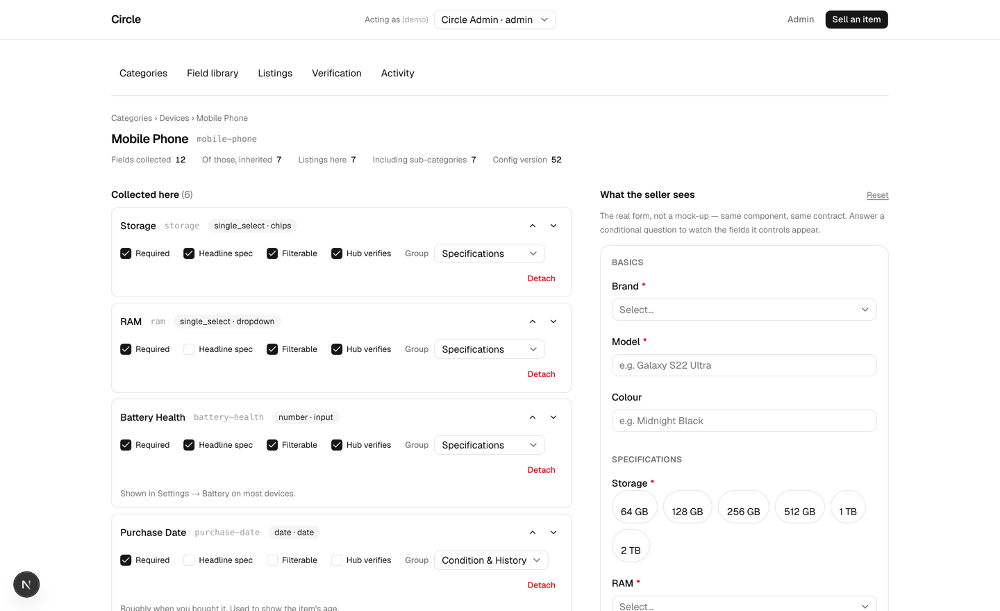
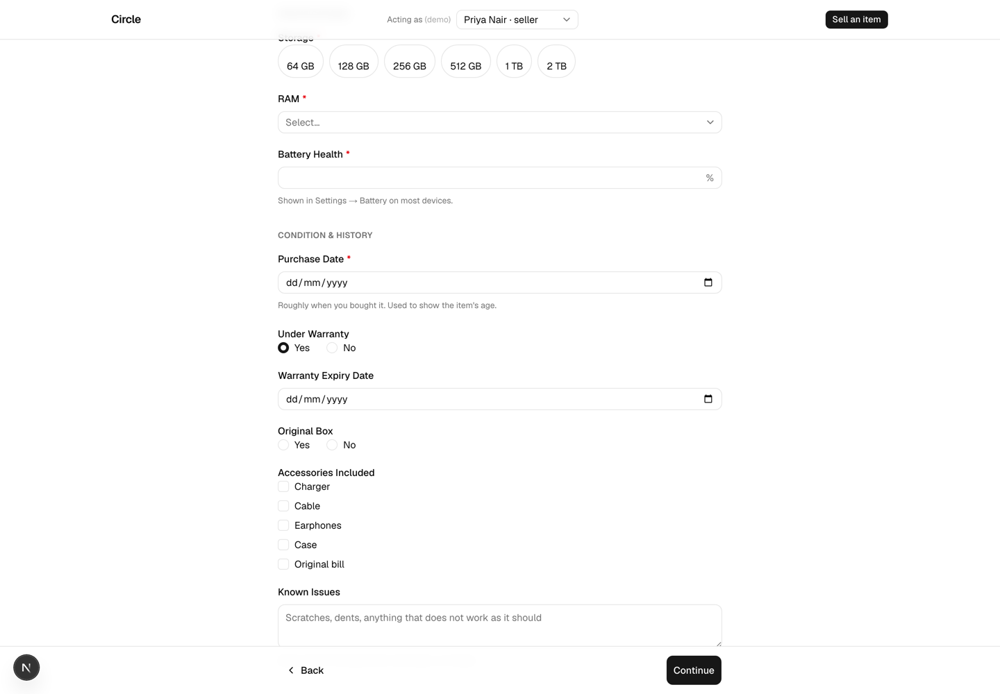
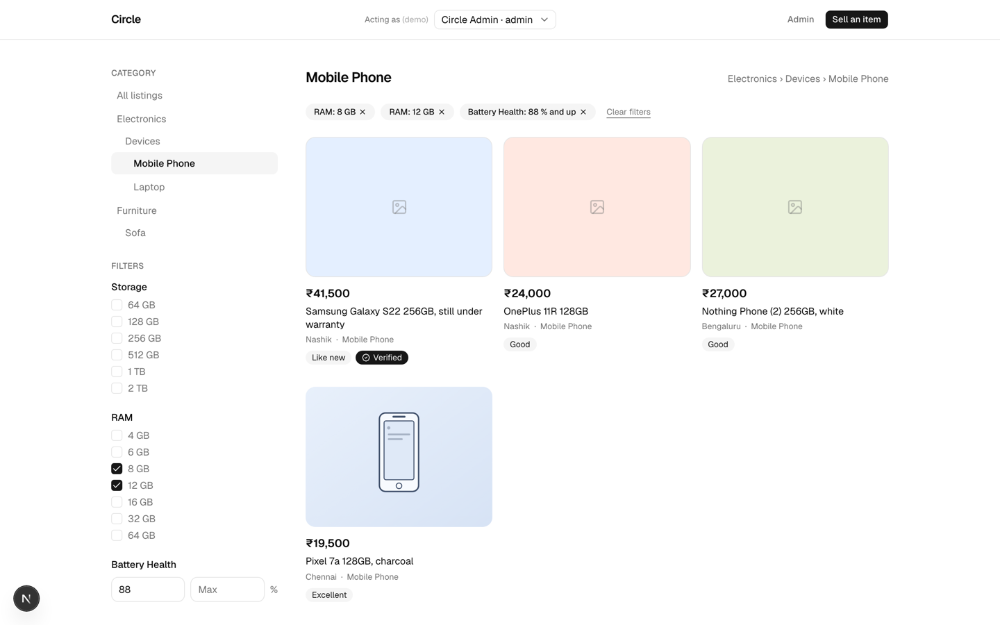
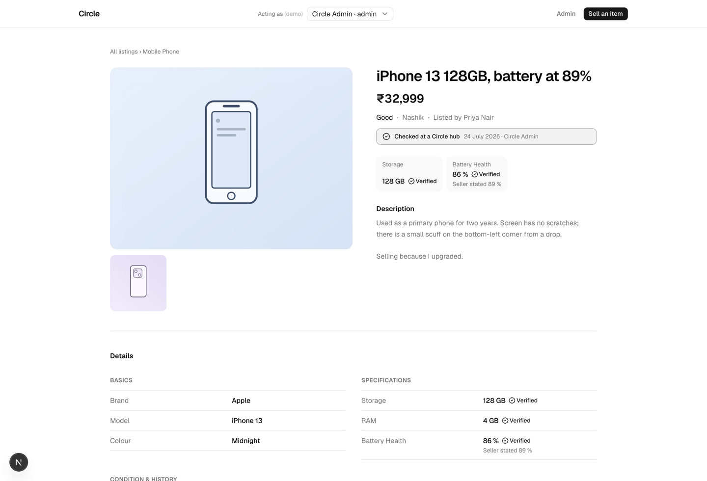

# Circle — a category-driven Sell Product flow

A secondhand marketplace where **new product categories and the fields they collect
are configured, not coded**. There is exactly one form renderer. What a Mobile Phone
is lives in database rows, so a new category is an admin's afternoon and an
engineer's zero deploys.

**Demo:** https://circle-sell-flow.vercel.app · there is no login — use the
**Acting as** control in the header to switch between `admin@circle.example` (sees
the admin console) and the two seeded sellers. **Local setup:** [SETUP.md](SETUP.md),
five commands. **Full decision log:** [docs/DECISIONS.md](docs/DECISIONS.md).

---

## The problem, and the half of it that is actually hard

The brief asks for a sell flow that survives new categories without being rewritten.
That part is a solved shape: put the field definitions in tables and render from them.

The hard half is what the brief does not say out loud. Once definitions live in rows
that non-engineers can edit, **the schema is mutable at runtime while data already
exists against older versions of it.** Someone archives a field that 400 listings
hold. Someone makes a field required a month after those listings were written.
Someone renames "Battery Health" to "Battery %". Someone moves a category to a new
parent and swaps its inherited field set wholesale. Every difficult decision in this
repository descends from that, and most of the code that is interesting is about it.

The cheap way to make everything flexible is to make everything a string and validate
nothing. For a marketplace whose product is trust, that fails while looking like it
passed. **Flexibility and rigour together is the whole ask**, so the design is judged
here on both.

---

## Sixty-second architecture

Two decisions that are usually conflated, made separately:

**1. Field _definitions_ → fully normalised relational tables.** A reusable field
library, plus a many-to-many join that assigns fields to categories. This alone is
what satisfies the brief.

**2. A listing's _values_ → one `jsonb` column, keyed by immutable field slug.**
This is a storage decision with nothing to do with extensibility, and it is the one
that needed defending — see [the trade-off](#storage-jsonb-and-the-integrity-bought-back).

```
categories ─────┐ id · parent_id · slug · name · sort · is_active · config_version
                │   (a tree: fields apply downward, nearest ancestor wins)
                ▼
        category_fields  ← the assignment: everything contextual lives here
                ▲          category_id · field_id · required · sort · group_id
                │          default_value · visible_when · help_text
                │          filterable · prominent · verifiable
                │
fields ─────────┘ id · slug UNIQUE · label · type · render_as · config
   │                placeholder · help_text · archived_at
   │                (a shared library: RAM is one row, used by two categories)
   ▼
field_options     id · field_id · value_slug · label · sort · archived_at
field_groups      id · slug · label · sort   (form sections, e.g. "Specifications")

listings          typed columns for what the platform reasons about
                  + category_id · attributes jsonb · verified_attributes jsonb
                  + schema_version · idempotency_key
audit_log         actor_id · action · entity_type · entity_id · before · after · at
```

The dividing line for what earns a typed column: **if the platform's own code needs
to sort, filter or price on it, it is a column; if only a human reads it, it is
data.** Title, price, condition and city are columns. Battery health is data.

### Fields are a library; assignments own the context

The brief's own bullets separate "create, edit and organize listing **fields**" from
"configure which fields **belong to each category**", and its three example
categories share five fields between them. So:

- the **field** owns identity and type — RAM is a single-select of GB values, forever;
- the **assignment row** owns everything contextual — required, order, group, default,
  help text, visibility condition, filterable, verifiable.

Battery Health is required on a handset and optional on a laptop. One field, two
policies, no duplication. Defining RAM twice would already be a modelling bug.

### `type` and `render_as` are different things

Radio versus dropdown is not a type. `single_select` is a storage and validation
contract; whether it renders as radios, a dropdown or chips is presentation. Modelling
them apart halves the validation code and makes "make that a radio group" a
one-column toggle rather than a new type with its own validator.

### One validation definition, three enforcers

Validation is **generated from the registry**, never hand-written twice:

1. in the browser, so the seller gets inline errors;
2. in the API, because the client is never trusted;
3. in **Postgres**, as a trigger that reads the same registry rows in SQL — so a
   writer that bypasses the application entirely (a script, a future mobile client, a
   2 a.m. `psql` session) still cannot store attributes that contradict the
   configuration.

The trigger is the most load-bearing thing in the repository, and it is what makes
`jsonb` defensible rather than lazy. It checks types, that every key is an active
field the category actually collects, and that select values are **live options of
that exact field** — the referential integrity a foreign key would have given us if
the value lived in a column. It deliberately does _not_ check required-ness:
completeness is a property of publishing, not of a row, because drafts are
legitimately incomplete.

---

## What it looks like

The admin console, with the seller's form rendered live beside the configuration —
the same component and the same contract the sell flow uses, not a mock-up:



The generated form. Every input, its type, its help text, its units and its
conditional behaviour come from rows — including **Warranty Expiry**, which appeared
because the answer above it is "Yes":



Browse, with per-category filters generated from the same `filterable` flag an admin
ticks on an assignment:



The product page: category-specific attributes grouped as configured, and what the
hub measured shown beside what the seller claimed:



---

## Adding a category without touching code

The claim this project actually makes, stated precisely, because "it takes five
minutes" is vague and undersells it:

**Creating the category is one `INSERT` and it is live immediately** — no migration,
no deploy, no restart, and it appears in the seller's category picker on the next
request. What takes a few minutes is the interesting part: deciding what it collects.

Walk it yourself on the demo, as `admin@circle.example`:

1. **Admin → Categories → New category.** Name it "Tablet", parent "Devices".
   It exists now. Its slug is derived, not typed, because a slug is a URL and an
   immutable key.
2. **Open it.** It already collects **7 fields it never declared** — Brand, Model,
   Colour, Under Warranty, Warranty Expiry from Devices, and Purchase Date and Known
   Issues from Electronics above that. That is inheritance doing the work: the
   marginal category is nearly free. Mobile Phone itself declares 6 of the 12 fields
   a seller meets; the other 6 arrive from above.
3. **Assign what is genuinely new** from the field library — reuse Storage and RAM
   rather than redefining them, so a Tablet's storage is the _same field_ as a
   handset's, filterable with the same options. Tick Required, Filterable, Hub
   verifies; drop them into a group; reorder with the arrows. The panel on the right
   is the real seller form, updating as you go.
4. **Sell an item → Tablet.** The form is there, validated in three places, with no
   code written and nothing deployed.

If a field genuinely does not exist yet, **Field library → New field** creates it —
type, presentation, options, min/max, help text, placeholder — and it is immediately
assignable to any category.

The mechanical proof that none of this is faked: a test walks `src/` and **fails the
build if any category name appears in application code** (`tests/no-hardcoded-categories.test.ts`).
The brief says "avoid creating separate hard-coded forms for individual categories";
this is that prohibition enforced rather than asserted. It has caught its own author
three times — a placeholder reading `e.g. Tablet`, and twice on a code comment — which
is roughly the point of having it.

---

## Decisions, with what was rejected

The full log with the reasoning is [docs/DECISIONS.md](docs/DECISIONS.md) (18
sections, written as the work happened rather than reconstructed afterwards). The
load-bearing ones:

### Storage: `jsonb`, and the integrity bought back

| Option                       | Why not                                                                                                                                                      |
| ---------------------------- | ------------------------------------------------------------------------------------------------------------------------------------------------------------ |
| Wide table, nullable columns | A migration plus a deploy per field — fails the brief's only hard requirement                                                                                |
| One table per category       | The most expensive option; cross-category reads become `UNION`s over N tables of unknown shape                                                               |
| **EAV**                      | Genuinely stronger integrity and better planner statistics — but pays a pivot in _every_ read path and N-row writes, for filtering the brief never asked for |
| `jsonb` + an EAV projection  | The scaling exit path, not the starting point                                                                                                                |

Chosen: `jsonb`, because the brief has no filtering requirement (cards need only
common columns), because it is dramatically less code in every read path, and because
one validated object flows form → API → database → product page without a
transformation in the middle.

**I want to be honest about the usual objection rather than repeat the folklore.**
"EAV has no type safety and produces queries from hell" is backwards: typed value
columns plus a composite foreign key make wrong data _physically unstorable_, and its
filters are ordinary btree predicates with real statistics. The correct statement is
that **EAV buys integrity and query statistics at the cost of read ergonomics — I
chose `jsonb` and bought the integrity back with a trigger.** If faceted counts over
tens of millions of listings were a day-one requirement, I would have chosen EAV.

Three hardenings, without which `jsonb` is laziness:

1. **Immutable `slug` as the key, mutable `label` for display.** Renaming a field
   never touches a listing row; the slug input is disabled after creation and a
   database trigger refuses a change.
2. **Validation generated once, enforced three times** (above).
3. **Registry-aware writes.** Unknown keys rejected; keys must be active fields
   assigned to that category; select values must be live options; values coerced to
   the field's declared type.

### Postgres details that are load-bearing

- **`gin (attributes jsonb_ops)`, not the smaller `jsonb_path_ops`.** `jsonb_path_ops`
  does not support the key-existence operators, and "is this field still in use?" is
  `attributes ? 'slug'` — with the wrong index that check silently becomes a
  sequential scan.
- **The planner has no key-level statistics inside `jsonb`.** It guesses. Expression
  indexes on hot keys are therefore about _plan quality_, not just speed — which is
  also the first rung of the scaling path.
- **Money in integer paise, never a float.** Purchase date is `date`; `created_at` is
  `timestamptz`; the hub's timestamps render in IST.

### Inheritance is `DISTINCT ON (field_id) ORDER BY field_id, distance`

A category resolves its fields from itself and every ancestor, in one recursive CTE,
and the **nearest ancestor wins** on conflict. That single line is what makes
"required here, optional everywhere else" an override instead of a contradiction, and
what makes a sibling category cheap. Two queries resolve a whole form, with options
aggregated in a lateral join — no N+1 however many fields a category has.

### Seller-claimed and hub-verified are two documents, never an overwrite

Circle's thesis is that trust is the product, so the data model says it: a listing
carries `attributes` (what the seller claims) and `verified_attributes` (what a hub
measured), and the page shows _"89% ✓ Verified · seller stated 92%"_ when they
disagree. A `CHECK` constraint makes a verified value that cannot name **who**
recorded it and **when** physically unstorable — an unattributable measurement is
exactly the unfalsifiable claim the feature exists to replace.

Marking a field **Hub verifies** on its assignment is what puts it on the hub's form —
which is `<DynamicForm>` again, filtered. The registry drives four surfaces (sell,
verify, browse filters, product page) with one contract and no new form code.

---

## Edge cases, handled rather than avoided

The full 41-item sweep is in [docs/EDGE-CASES.md](docs/EDGE-CASES.md), each item
either handled with a pointer to the code and its test, or deferred with a reason.
The ones worth reading are the config-lifecycle group, because they are where a
runtime-editable schema either holds up or quietly corrupts data:

- **Nothing is ever hard-deleted.** Fields, options and categories archive.
  Archived things leave new forms immediately and stay on every existing listing —
  that asymmetry is the point: configuration describes what to collect _now_, a
  listing records what was collected _then_.
- **Every destructive action states its blast radius first,** in listings, before it
  is applied. "Archive Battery Health?" says how many categories stop collecting it
  and how many listings keep their value.
- **A field's type can never change in place.** Nothing can reinterpret "eight GB" as
  a number, so it is a new field plus an optional backfill — refused in the action, in
  the UI, and by a trigger.
- **Making a field required changes nothing about existing listings.** Validation is
  on write; a config change never reaches backwards. The admin sees the count first
  ("4 of 7 existing listings have no answer — they stay live and stay valid"), and
  **completeness is derived on read**, never stored, and shown only to a listing's own
  seller.
- **Hidden means absent.** A field hidden by its condition is not required, and its
  value is _stripped server-side_ — otherwise a row claims both that there is no
  warranty and that it expires next March.
- **Visibility cycles and dead required fields are rejected at save time**, when
  someone is still around to fix them, by validating the whole resolved schema rather
  than the row being edited. A required field behind an impossible condition is a form
  nobody can submit and nothing else would catch.
- **Re-parenting a category previews the swap.** It is the one edit whose effect is
  invisible from the row being edited — the category's own assignments do not change,
  yet the form can gain or lose half its questions.
- **Re-categorising a listing names every answer that will not survive** before it is
  applied, keeps the ones both categories collect, and records the dropped values in
  the audit log. The database enforces this: a category change revalidates _every_
  attribute, so a handset cannot be moved into Furniture carrying its battery health.
- **Switching category mid-draft keeps the answers the new category still collects** —
  which falls out of the shared field library for free, and is the cheapest available
  demonstration that the model is right.
- **Values outlive their definitions.** A listing holding an archived field, a
  detached field, or a retired option keeps rendering it under "Additional details".
  A config change must never rewrite history.

Also handled: idempotent listing creation (a double-tapped submit on a flaky
connection returns the first listing rather than creating a second), keyset
pagination that survives ties, mass-assignment (`status`, `seller_id`, `verified_*`
are not settable from a request body), an `ETag` on the hot form-schema endpoint keyed
on `config_version`, a rate limit on listing creation, and the non-obvious XSS hole —
React escapes JSX but **not** the contents of a `<script type="application/ld+json">`
tag, so seller text in the structured data is escaped deliberately.

---

## The scaling exit path

When faceted counts over a large catalogue become a primary read pattern — which is
where `jsonb` genuinely hurts — the path is, in order:

1. **Expression indexes on hot keys** (`((attributes->>'ram'))`). Carries its own
   statistics, so it fixes plan quality as well as speed.
2. **An EAV projection table maintained by trigger** — `(listing_id, field_slug,
value)` written alongside the `jsonb`. Counts become an ordinary grouped query with
   real statistics.
3. **An external search index** when facets, free text and relevance have to be one
   query instead of three.

The point worth making: **none of those rungs touches the configuration model.** The
registry, the resolver, the generated validation and the seller flow are identical in
all three worlds — which is the argument that `jsonb` was a storage decision rather
than an architectural one.

This is why buyer-side facets ship **without option counts** ("8 GB (12)"). Counting
per option over `jsonb` needs an expression index per key or a scan; at demo scale a
scan is instant, which is exactly what makes it the wrong thing to ship — it would
look finished and fail at the first real catalogue, with nothing in the UI admitting
it.

---

## Deliberately left out

Stated rather than silently skipped, because a quiet omission reads as an oversight:

- **Photo uploads.** The rendering path is complete — ordering, primary image, alt
  text, a designed placeholder, sample images in the seed — but there is no upload. It
  needs object storage, a signed-upload route, and MIME sniffing rather than extension
  trust; HEIC and EXIF rotation belong with it.
- **Authentication.** Out of scope for the assignment. The demo switches between
  seeded accounts, but identity is resolved server-side from a cookie that can only
  name an account, roles are read from the row on every request, and every mutation
  re-checks — so replacing it with a real session lookup changes nothing else.
- **Facet counts**, above, and free-text search: containment cannot express "contains
  the word", and a substring scan over `jsonb` has no index to help it.
- **Old-slug redirects.** Listing slugs are stable and SEO-bearing; the 301 cannot
  arise yet because there is no listing-edit path.
- **Duplicate detection** by perceptual hash, **AI condition grading**, and
  **model → spec autofill** (choosing "iPhone 13" pre-filling its storage options).
- **Field-level drop-off analytics** — the thing that would actually tell an admin
  that a field they added is costing them listings.
- **Internationalisation and unit systems.** `unit` is a display string today, not a
  convertible quantity.

---

## Tests

```bash
npm test        # 179 unit tests — pure logic, no database. Runs on a bare clone
npm run test:db #  79 integration tests — against a real, seeded Postgres
```

Split deliberately: a reviewer can clone and run `npm test` immediately, while the
tests whose substance _is_ a recursive CTE or a Postgres trigger run against a real
database, because a mocked version of them would prove nothing.

They are table-driven over **field types** rather than over categories — testing
"Mobile Phone renders correctly" would be testing the sample data, and the whole
claim is that no code knows what a Mobile Phone is. The rest cover the genuinely
tricky logic: conditional visibility, required-if, hidden-value stripping, cycle
rejection, unknown-key rejection, config validation, archive-in-use, orphaned values
after a config change, idempotent creation, and the invariant test above.

## Stack

Next.js 16 (App Router) · TypeScript · Postgres · Drizzle · Zod · Tailwind and
shadcn/ui · Vitest. Deployed on Vercel against Supabase Postgres, both in Mumbai.

Chosen to be close to Circle's own stack, and hand-written rather than generated.
Next.js because the product page is the SEO-bearing page of a marketplace, so server
rendering is a product argument rather than a preference; Drizzle because this schema
needs hand-written constraints, triggers and a recursive CTE that an ORM's abstraction
would fight; Zod because the same generated schema has to run in the browser and on
the server.

## Layout

```
SETUP.md            how to run it, and how it is deployed
docs/DECISIONS.md   the decision log, written as the work happened
docs/EDGE-CASES.md  41 cases, each handled or deferred with a reason
drizzle/            generated SQL migrations, committed and reviewed
src/app/            routes — browse, sell, listing, admin, API
src/components/     ui/ is shadcn; form/ is the one renderer
src/db/             schema, client, migrate and seed
src/lib/            form-schema resolution, validation, listings, admin actions
tests/              cross-cutting tests, including the one-renderer invariant
```
